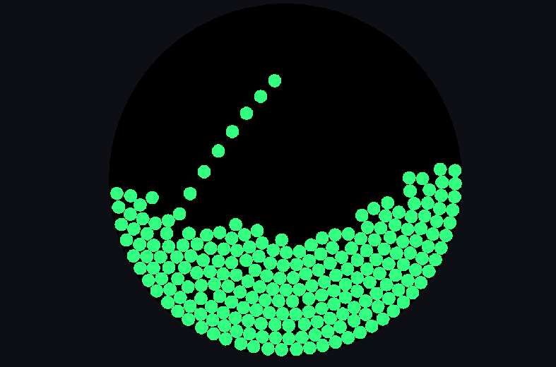

# Jot

Super minimal graphics library

`
I'm still figuring out what a good api would look like so there could be a lot of breaking changes.
`

## What it does

This library provides a simplified api over the following:

- [x] Application Window
- [x] 2D Renderer
- [x] Input
- [ ] Audio

## What it doesn't do

This library does not touch any game logic. Entities, game data, and game systems can be completely handled by you.

